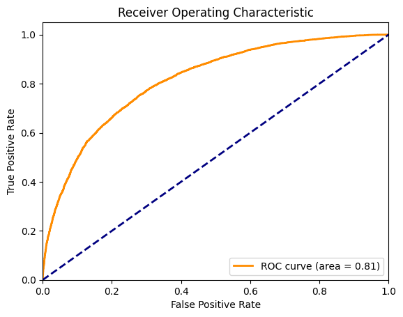

# 🩺 Population Health Risk Stratification Using PySpark & Databricks

Tools: Databricks, PySpark, Spark MLlib, MLflow, Python, Pandas, seaborn

Duration: ~2 weeks

Goal: Demonstrate scalable machine learning and end-to-end workflow design for healthcare analytics.

## 📘 Overview

This project explores how large-scale health and demographic data can be used to identify individuals at elevated population health risk using a distributed machine learning pipeline.

The focus is on scalability, interpretability, and workflow design, not just model accuracy — showcasing how data science can translate into actionable business insights in a healthcare setting.

## 🎯 Objectives

Ingest and preprocess population-level datasets (BRFSS, US Census).

Engineer socioeconomic and behavioral features for health risk prediction.

Train and evaluate classification models using PySpark MLlib on Databricks.

Log and version models using MLflow.

Simulate deployment through a batch inference pipeline.

## ⚙️ Technical Stack

| **Component** | **Technology**                                      | **Purpose** |
|----------------|-----------------------------------------------------|--------------|
| Compute Environment | Databricks Community Edition                        | Cloud-based Spark cluster for distributed computation |
| Data Processing | PySpark                                             | Large-scale data cleaning, transformation, and feature engineering |
| Machine Learning | Spark MLlib (Random Forest, Gradient Boosted Trees) | Risk prediction modeling |
| Experiment Tracking | MLflow                                              | Model versioning, metric tracking, and experiment management |
| Visualization | Seaborn, Matplotlib                                 | Exploratory data analysis and model insight visualization |
| Deployment Simulation | MLflow Model Loading                                | Batch scoring workflow and simulated production pipeline |

## 📂 Notebooks

### Databricks training and inference
- `transform_data.ipynb` Read in data, perform data cleaning and necessary transformations.
- `train_model.ipynb` Optimise hyperparameters; train, evaluate and save model.
- `infer_RFHLTH.ipynb` Simulate deployment by inferring health of simulated dataset. 

### Data exploration and utilities
- `explore_data.ipynb` Visualize features and target variable; select promising features. 
- `make_synthetic_data.ipynb` Create synthetic data with SDV to simulate inference. 
- `convert_BRFSS.ipynb` (Local notebook) Convert BRFSS data to parquet format.
- `convert_census.ipynb` (Local notebook) Convert US census poverty data to csv. 

## 📊 Results

|**Metric** | **Value** |
|----------|-----------|
|AUC (ROC)	| 0.814     |
|Accuracy	| 0.735     |
|Precision	| 0.726     |
|Recall	| 0.732     |
|F1 | 0.729     |

🩺 Interpretation:
While the model performance is moderate (AUC 0.81), it demonstrates the feasibility of large-scale risk modeling in a distributed environment. Although noisy on an individual level, it could still be useful to inform risk at population scales. 

⚠️ Warning: 
It is very likely that this model will have learnt biases that reflect the impact of intersectional disadvantage on minority groups. Before it was implemented in a production context, it would need to be examined through this lens and adjustments may be needed to ensure it meets ethical standards. 

## 🚀 Future Improvements

Expand feature set with spatiotemporal data to take into account seasonality.

Integrate with BI dashboards (Power BI / Tableau) for operational deployment.

Apply model explainability tools (SHAP or LIME for Spark).

## 🧩 Key Learnings

Practical experience with Spark optimization and and MLflow tracking - training models on data sets with 100,000s data points.

Learned how to design scalable ML pipelines for production-like environments.

Gained familiarity with databricks and the Unity catalogue. 

Generated synthetic data with SDV.

